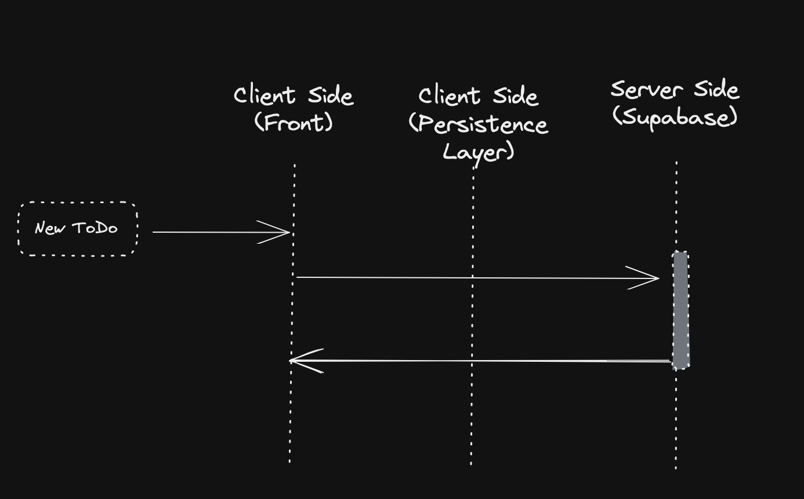

# - T O D O S T R I K E R -

## What's about TodoStriker?

*TodoStriker* is a demo app, to make simple todos list, prioritize them, order them and make your daily job simple and easy.
Also, enable you to create your own todos lists and saved them in the cloud.

Visit the productive TodoStriker app, TodoStriker [here](https://todostriker.vercel.app/)

### Actual TodoStriker scope

Actually, we gonna find that *TodoStriker* allows us:

- [x] Create todos with title and description (if you want it)
- [x] Assign a priority level to each todo
- [x] Delete todos
- [x] Swap the todos order using drag'n drop over the cards
- [x] Know how many todos we have remaining to complete
- [x] Filter todos by completed
- [x] Create todos list
- [x] Choose between dark and light theme

### What you will find in the V2?

For the next version you will be able to use:

- [ ] Authorization and authentication
- [ ] LogIn by several sources
- [ ] Integration tests

### Tech Stack

To develop TodoStriker, I decided to use:

- [NextJs](https://beta.nextjs.org/docs) (in the latest version - v13 - using RSC and Client components)
- [Supabase](https://supabase.com/) (as a cloud persistence layer as well as a BaaS, alowing me to use an internal API - Back as a Service)
- [Chakra UI](https://chakra-ui.com/) (as a Design System to manage theme, components and styles to make app responsive)
- [Zustand](https://github.com/pmndrs/zustand) + [Immer](https://immerjs.github.io/immer/) (to manage app state in the client)
- [@hello-pangea/dnd](https://github.com/hello-pangea/dnd) (to implement a draggable todos list)

### What model we choose to work with Supabase

When we decided to work with Supabase, we propose this relation between two main tables:


This, help us to determine what features TodoStriker will be able to offer.
We define cardinality of relation between todo and todoslist as 1 to (0...1) because we can have todos without the need to belong to any todoslist.
Just as if we were writing a todos list in a paper: *single todos*

Supabase is intuitive, easy to use, offers the opportunity to work with Postgre database, instant API and Storage.

As we said before, in the V2, we want to let available a LogIn and Authorization & Authentication layer. This allows us to think about develop capabilities and offers customization configs.

### What we use Chakra UI

We decided to use Chakra UI because its provides improved styling API, accesibility, and intuitive component APIs.
Due to this demo it's simple, Chakra UI was the best candidate to develop each part of the application.

### Basic flow to create a ToDo



### Basic flow to create a ToDos List


### Getting Started - Dev Environment

If you wanna run TodoStriker locally, but see like a production mode, we recommend you run this command:

```bash
npm run build && npmm run start
```

Open [http://localhost:3000](http://localhost:3000) with your browser to see the result.
